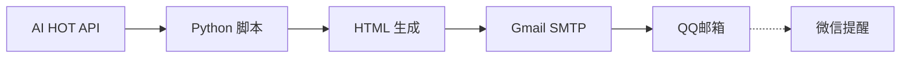

## 缘起

每天看 AI 信息太累了。Hacker News、ArXiv、Twitter、Reddit……全是噪音。

我的需求很简单：

1. **每天早上 8:30**，一封 HTML 邮件躺在 QQ邮箱
2. 微信弹窗提醒，点开就能看
3. 内容已经分好类、排好版
4. **零维护**，跑在 GitHub Actions 上不花钱

## 架构设计



## 核心代码

### 数据获取

```python
import requests

UA = "Mozilla/5.0 ... Chrome/124.0.0.0 Safari/537.36"

def fetch_daily_report():
    resp = requests.get(
        "https://aihot.virxact.com/api/public/daily",
        headers={"User-Agent": UA}, timeout=15
    )
    if resp.status_code == 200:
        return resp.json()
    # 404 回退到最近一期
    ...
```

### HTML 生成

日报生成的难点在于 **两版 HTML**：

| 版本 | 用途 | 特点 |
|------|------|------|
| 仪表盘版 | 浏览器查看 | 完整 CSS、滚动动画、粘性导航 |
| 邮件版 | Gmail 内嵌 | 内联样式、表格布局、无 JS |

邮件版是真正的坑——Gmail 会**剥掉所有 `<style>` 块、忽略 flexbox/grid、禁止 JS**。只能用 1999 年的 `<table>` 布局。

## 踩坑记录

### 坑 1：GitHub Actions YAML 不支持 `||` 默认值

```yaml
# ❌ 崩了 —— workflow 直接不显示在 Actions 页
OPENAI_BASE_URL: ${{ secrets.OPENAI_BASE_URL || 'https://api.openai.com/v1' }}

# ✅ 正确
OPENAI_BASE_URL: ${{ secrets.OPENAI_BASE_URL }}
```

### 坑 2：QQ邮箱 465 端口被 GitHub Actions 封

换了 587 STARTTLS → Gmail → 完美。

### 坑 3：中国大陆 git push HTTPS 被墙

SSH + Deploy Key 是唯一稳定方案。

## 最终效果

每天早上 8:30，一封 HTML 邮件自动到达：

- 🧠 模型发布/更新
- 🚀 产品发布/更新
- 📡 行业动态
- 📄 论文研究
- 💡 技巧与观点

五个版块，编辑精选 + LLM 摘要，3 分钟看完一天 AI 圈大事。

## 总结

> 自动化的本质不是节省时间——是**把注意力还给真正值得投入的事情**。

如果你也想搭一套，克隆 [daily-ai-report](https://github.com/CharlesRelentless/daily-ai-report)，配好 Gmail 应用密码，5 分钟上线。
